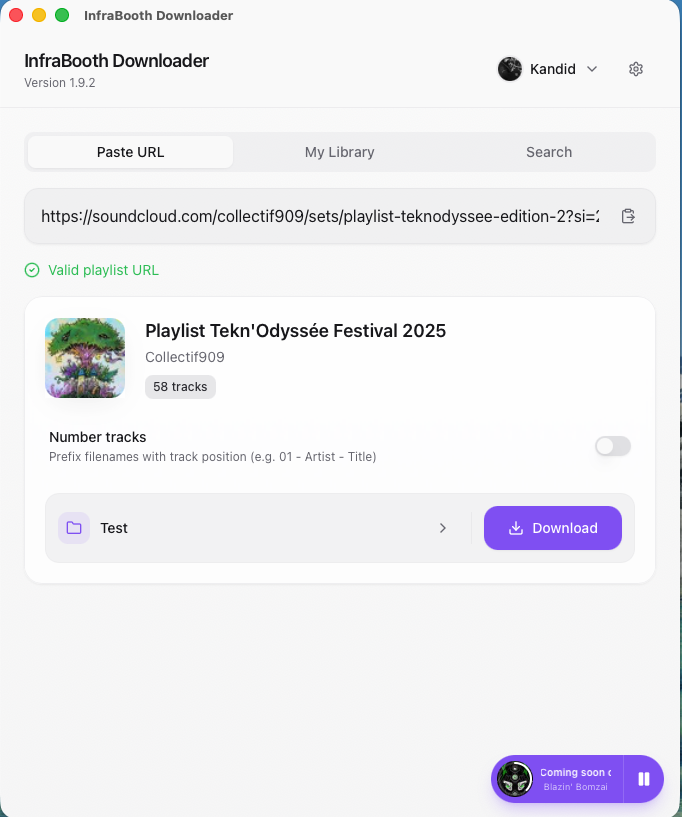
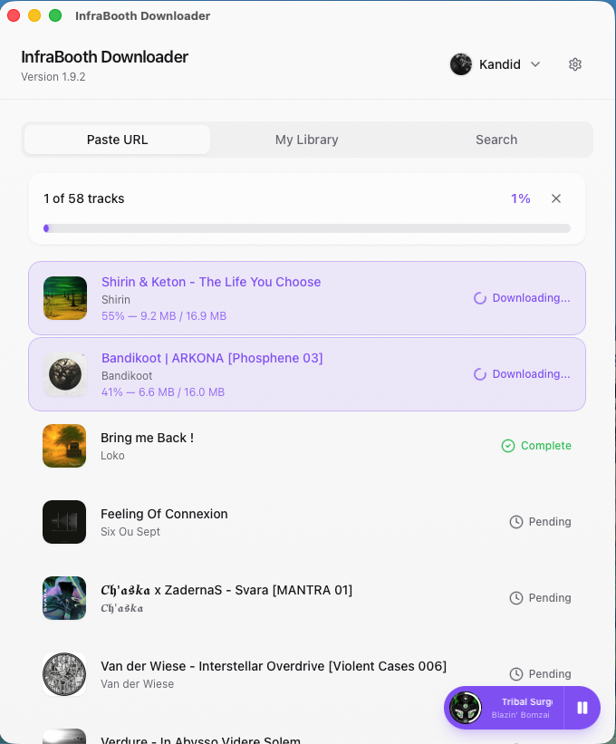
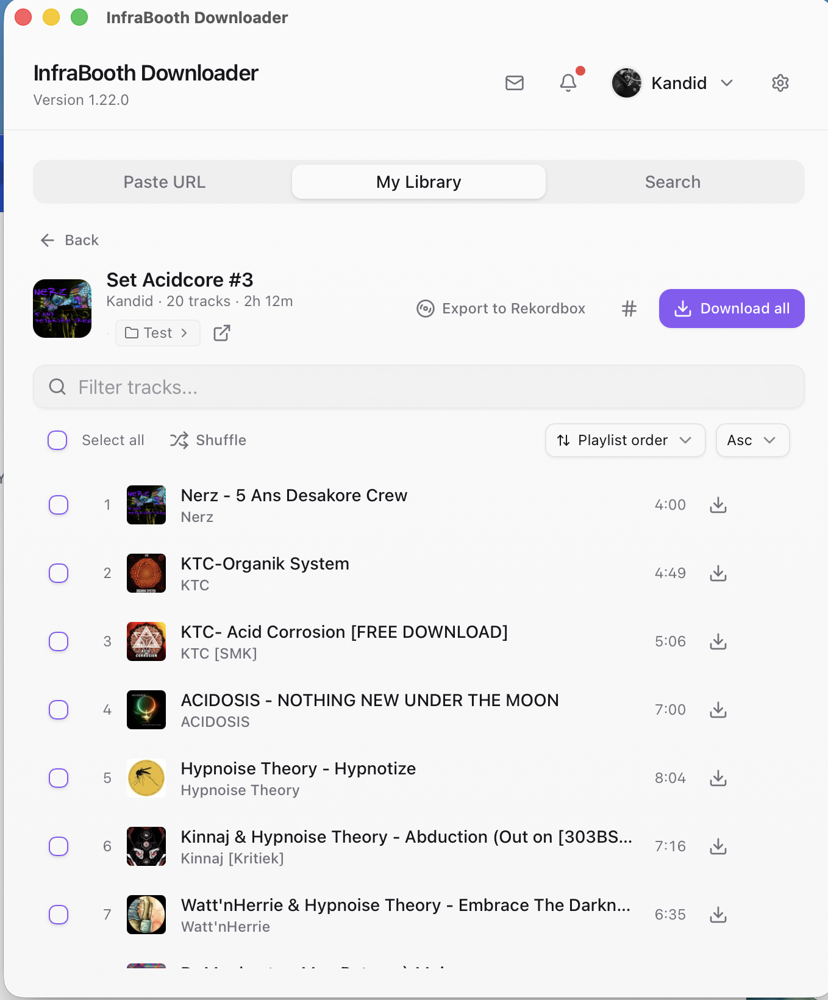
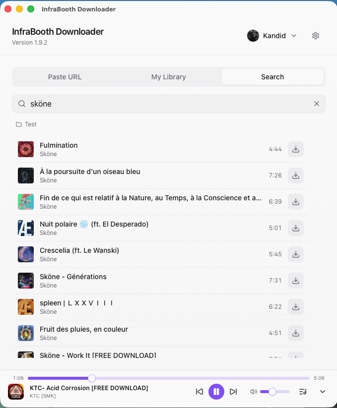

# InfraBooth Downloader

Download your favorite SoundCloud tracks and playlists with a single click. Get high-quality audio, automatic metadata, and album artwork — all in a beautiful native app.

**Already paying for SoundCloud Go+?** You're paying for 256kbps streaming — this app lets you actually keep those files at the quality you're paying for.

## Download

**[Get the latest release](https://github.com/bretheskevin/soundcloud-downloader/releases/latest)**

| Platform | Requirements |
|----------|--------------|
| macOS | 10.15 Catalina or later (Intel & Apple Silicon) |
| Windows | Windows 10 or later |

## Features

### Download Tracks & Playlists
Paste any SoundCloud URL and download instantly. The app handles single tracks, full playlists, and even short links.

### Download at Your Subscription Quality
The app detects your SoundCloud session from your browser and downloads at the quality you're entitled to. Go+ subscribers get their full 256kbps — the same quality you're already paying to stream.

### Built-in Music Player
Preview tracks before downloading with the integrated audio player. Build a queue, control playback, and use native media controls.

### Your Library at Your Fingertips
Browse your SoundCloud playlists directly in the app. See which tracks you've already downloaded, select individual songs, and download with one click.

### Search & Discover
Find any track on SoundCloud without leaving the app. Search, preview, and download individual songs instantly.

### Smart Downloads
- **Automatic metadata** — title, artist, and album art embedded in every file
- **Skip duplicates** — already-downloaded tracks are detected and skipped
- **Track numbering** — optionally prefix filenames with playlist position
- **Parallel downloads** — download up to 10 tracks simultaneously
- **Custom folders** — save to any location, per playlist or globally

### Stream Mode
Just want to listen? Enable stream mode to hide download features for a clean, focused listening experience.

### Thoughtful Extras
- **Auto-updates** — always stay on the latest version
- **Dark & light themes** — matches your system or set manually
- **English & French** — fully localized interface

## How It Works

1. **Sign in** (optional) — The app detects your SoundCloud session from your browser to download at your subscription quality
2. **Paste or browse** — Enter a URL or browse your SoundCloud library
3. **Download** — Click download and watch your tracks appear in your chosen folder

## Screenshots

  
  

  
  

## Third-Party Software

This application bundles [FFmpeg](https://ffmpeg.org/) for audio processing, licensed under [LGPL v2.1+](https://ffmpeg.org/legal.html). The binary is dynamically linked and unmodified. Source code is available at [ffmpeg.org](https://ffmpeg.org/download.html).

## License

MIT License — see [LICENSE](LICENSE) for details.

---

**Made with Tauri, React, and Rust**
