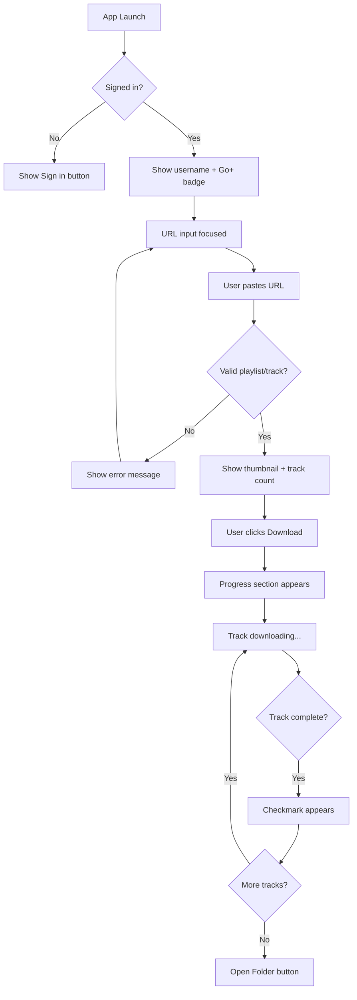
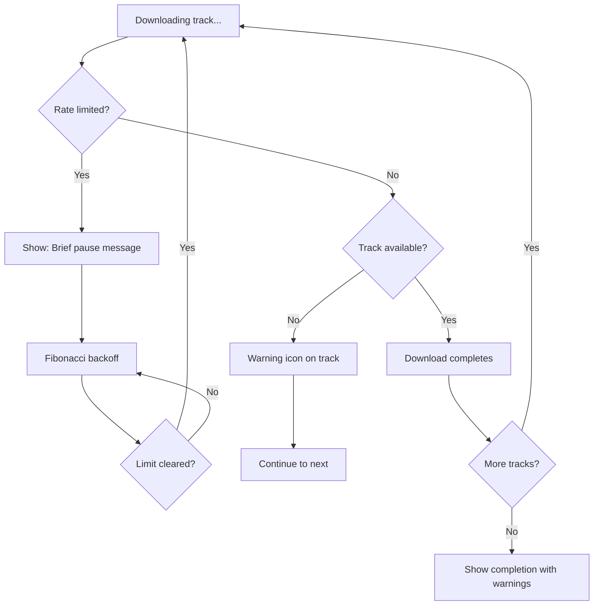
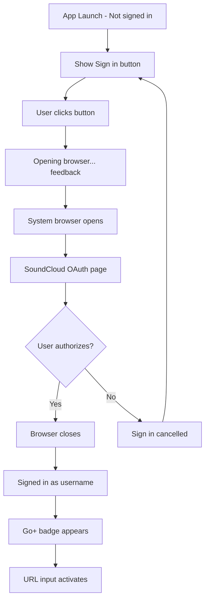
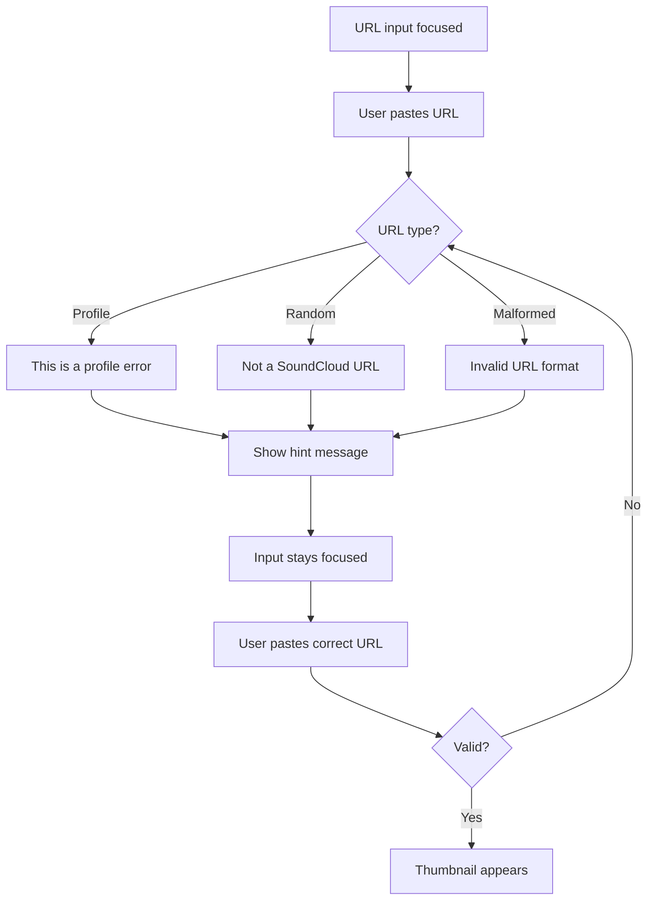

# UX Design Specification - sc-downloader

**Author:** Kandid
**Date:** 2026-02-05

---

## Executive Summary

### Project Vision

InfraBooth Downloader enables SoundCloud Go+ subscribers to download their playlists with full metadata — clean, trustworthy, and effortless. The core emotional arc: frustration → discovery → relief → ownership.

The product differentiator is authenticated access to 256kbps AAC quality that web scrapers cannot provide, wrapped in a desktop app that feels legitimate rather than sketchy.

### Target Users

**Marcus (Primary):** SoundCloud Go+ subscriber who has curated playlists over years. Frustrated that his music is locked in an app. Wants portable files he owns.

**Sarah (Secondary):** Skeptical first-time user who found the app via Reddit. Needs clear trust signals before engaging. Won't type credentials into anything that feels suspicious.

Both users share distrust of sketchy web download tools and desire for a clean, legitimate experience.

### Key Design Challenges

1. **Trust Moment:** OAuth browser popup must feel seamless, not jarring. Immediate confirmation of success when returning to app.
2. **Progress Anxiety:** 47-track downloads need constant, alive feedback. Clear per-track status, visible momentum even during rate-limit pauses.
3. **Graceful Failure:** Geo-blocks and partial failures must communicate the *reason*, not just the failure. Users blame restrictions, not the app.
4. **Simplicity vs. Depth:** Zero-config defaults for happy path, with power-user options (format, numbering) available but not overwhelming.

### Design Opportunities

1. **"Signed in as..." Trust Signal:** Amplify the moment users see their username appear without having typed their password in the app.
2. **Completion Satisfaction:** 47/47 with checkmarks is a dopamine moment — make it feel genuinely satisfying.
3. **Error Transparency as Trust:** Clear, honest error messaging becomes a feature that builds trust rather than frustration.

## Core User Experience

### Defining Experience

The core experience is deceptively simple: **Paste URL → Download → Own your music.**

The critical moment is the paste action. Within 500ms of pasting a valid SoundCloud URL, the user sees instant validation with a thumbnail preview and track count. This immediate feedback establishes trust before any download begins. Invalid URLs receive equally fast feedback — error states match success state speed.

The app's default state shows the signed-in username prominently, reinforcing that authentication worked and the user is ready to go.

### Platform Strategy

| Aspect | Decision |
|--------|----------|
| Platform | Desktop application (Tauri: Rust + TypeScript) |
| OS Support | Windows 10+, macOS 11+ |
| Input Method | Mouse/keyboard, with paste as primary interaction |
| Offline | UI loads offline; downloads require connection |
| System Footprint | Zero — no background processes, no startup items |

### Effortless Interactions

1. **URL Paste** — Instant recognition and thumbnail preview without manual "analyze" step
2. **URL Validation** — Invalid URLs rejected within 500ms with clear guidance
3. **Download Start** — Single click with remembered download location
4. **Rate Limit Handling** — Automatic pause/resume with reassuring status: "Brief pause — SoundCloud rate limit (this is normal)"
5. **File Output** — Proper filenames and embedded metadata without user configuration
6. **Completion Action** — "Open Folder" button appears when download finishes for immediate access

### Critical Success Moments

1. **First Paste** — Thumbnail and track count appear within 500ms, establishing trust
2. **Invalid URL Rejection** — Equally fast feedback with clear "This isn't a track or playlist" message
3. **OAuth Return** — "Signed in as [username]" displays immediately when browser closes
4. **First Checkmark** — Visual proof that the download pipeline works
5. **Rate Limit Pause** — Reassuring message that frames the pause as normal, with optional technical details
6. **Completion State** — All tracks show green checkmarks + "Open Folder" button for instant gratification

### Experience Principles

1. **Instant Feedback** — Every user action receives immediate visual response (success AND failure)
2. **Transparency Without Alarm** — Status shown calmly with reassurance; technical details available but not leading
3. **Zero-Config Confidence** — Smart defaults work out of the box; options available but not required
4. **Trust Through Visibility** — Authentication state, progress, and errors always clearly displayed

## Desired Emotional Response

### Primary Emotional Goals

| Goal | Description |
|------|-------------|
| **Confidence** | Users feel certain the app will work from the first moment |
| **Relief** | "Finally, something that just works" — the dominant emotional experience |
| **Gratitude** | Completion feels like a gift, not just a transaction |

### Emotional Journey Mapping

| Stage | Target Emotion | How We Achieve It |
|-------|----------------|-------------------|
| First Open | Confidence | Clean UI, visible signed-in state, professional appearance |
| URL Paste | Validation | Instant thumbnail preview proves the app understood |
| Download Running | Relief | Living progress indicators, checkmarks appearing in real-time |
| Rate Limit Pause | Informed Calm | Reassuring message frames pause as normal, not broken |
| Partial Failure | Acceptance | Clear explanation directs frustration at restriction, not app |
| Completion | Gratitude | Visual completion celebration + immediate "Open Folder" action |
| Return Visit | Trust | Remembered settings, familiar experience |

### Micro-Emotions

**Cultivate:**
- Confidence over confusion
- Trust over skepticism
- Relief over anxiety
- Accomplishment over frustration
- Gratitude over entitlement

**Avoid:**
- Panic during pauses
- Blame during failures
- Overwhelm from options
- Doubt about security

### Emotional Design Principles

1. **Confidence Through Clarity** — Every UI element earns its place; no mystery states or unexplained behaviors
2. **Relief Through Predictability** — The app behaves exactly as expected; no negative surprises
3. **Gratitude Through Honesty** — Transparent failure messaging builds trust rather than frustration
4. **Success Through Framing** — Partial completion is celebrated as success with context, not failure with consolation

## UX Pattern Analysis & Inspiration

### Inspiring Products Analysis

#### WeTransfer — Trust Through Radical Simplicity
- Single-purpose UI with one dominant action area
- Progress animation feels alive and engaging
- No account friction — trust established before commitment
- Completion is celebratory with immediate next action

#### Transmit — Progress That Satisfies
- Per-file status with real-time checkmark updates
- Dual progress: overall counter + individual item states
- Failures highlighted inline, not hidden
- Technical details available but not overwhelming

#### HandBrake — Power Made Accessible
- Smart presets for common use cases
- Obvious primary action button
- Preview of exactly what will happen
- Advanced settings available but tucked away

### Transferable UX Patterns

**From WeTransfer:**
- Single input field dominates the interface
- Progress animation that feels alive
- Completion celebration with clear next action ("Open Folder")

**From Transmit:**
- Per-track status icons (pending → downloading → ✓)
- Overall "X of Y" counter alongside individual states
- Failed items visible inline with clear explanations

**From HandBrake:**
- Zero-config defaults that just work
- Single obvious "Download" button
- Playlist preview showing exactly what user will receive
- Settings available but not prominent

### Anti-Patterns to Avoid

| Anti-Pattern | Alternative |
|--------------|-------------|
| Mystery progress bars | Per-track status + overall count |
| Silent failures | Inline warnings with clear reasons |
| Settings-first UI | Zero-config defaults, settings tucked away |
| Fake urgency/pressure | Calm, patient, trustworthy tone |
| Password entry in app | OAuth browser popup only |

### Design Inspiration Strategy

**Adopt Directly:**
- WeTransfer's single-focus UI philosophy
- Transmit's per-item progress with inline status
- HandBrake's "presets for everyone, power for few" approach

**Adapt for Context:**
- WeTransfer's upload animation → download progress with track artwork
- Transmit's file list → playlist track list with metadata preview

**Avoid Completely:**
- Any pattern that creates doubt about security
- Any progress indicator that feels static or dead
- Any error handling that hides or obscures failure reasons

### Subscription Value Messaging

**Critical UX requirement:** Users must understand that signing in with a Go+ subscription unlocks the highest quality SoundCloud offers. This differentiates InfraBooth from 128kbps web scrapers.

**Before Login:**
- "Sign in with SoundCloud Go+ to download at full quality — 256kbps AAC, the highest SoundCloud offers"

**After Login:**
- "Signed in as [username] — downloading at Go+ quality (256kbps AAC)"
- Quality indicator visible in download preview

**Educational Framing:**
- "256kbps AAC is SoundCloud's maximum streaming quality for Go+ subscribers. InfraBooth downloads exactly what your subscription unlocks — no compression, no quality loss."
- Contrast with scrapers: "Free web tools max out at 128kbps. Your Go+ subscription gives you double that."

**Value Proposition Clarity:**
- Make it obvious this tool captures the *full* quality SoundCloud delivers — not a limitation, but the maximum available
- Position authentication as *unlocking value*, not as friction
- The 256kbps ceiling is SoundCloud's, not ours — we deliver everything your subscription provides

## Design System Foundation

### Design System Choice

**Approach:** Themeable System — Tailwind CSS + Shadcn/ui

**Tech Stack:**

| Layer | Choice |
|-------|--------|
| Desktop wrapper | Tauri (Rust + TypeScript) |
| Frontend framework | React |
| Build tool | Vite |
| Styling | Tailwind CSS |
| Components | Shadcn/ui |

### Rationale for Selection

1. **Shadcn/ui aligns with our aesthetic goals** — Clean, minimal, professional. Matches WeTransfer-inspired simplicity.
2. **Components you own** — Not a dependency; copy-paste into your codebase and customize freely.
3. **Tailwind enables rapid iteration** — Utility classes make polish fast without fighting CSS specificity.
4. **React ecosystem** — Largest component ecosystem, easiest to find solutions and examples.
5. **Vite + Tauri** — Native pairing, fast builds, excellent developer experience.
6. **No unnecessary complexity** — No SSR, no server routes, no Next.js overhead for a desktop app.

### Implementation Approach

- Initialize Tauri project with React + Vite template
- Add Tailwind CSS configuration
- Install Shadcn/ui CLI and add components as needed
- Customize theme tokens (colors, typography, spacing) to match InfraBooth brand

### Customization Strategy

**Theme Tokens to Define:**
- Primary color (brand accent)
- Success/warning/error states for download status
- Typography scale (clean, readable, minimal)
- Spacing rhythm for consistent layout

**Components to Customize:**
- Progress indicators (alive, animated per our UX principles)
- Status badges (checkmarks, warnings)
- Input field (prominent URL paste area)
- Buttons (confident, obvious primary action)

## Defining Experience

### The Trust Moment: OAuth Authentication

The defining experience for InfraBooth Downloader is the OAuth completion — the moment users see their username appear without having typed their password into the app.

**Why this moment defines the product:**
- Establishes trust before any download action
- Proves legitimacy through browser-based authorization
- Differentiates from password-harvesting sketchy tools
- Connects authentication directly to value: "Go+ quality unlocked"

### User Mental Model

**What users expect:** Download tools ask for passwords. This feels risky.

**What InfraBooth delivers:** Browser opens to real SoundCloud page. User authorizes there. Browser closes. Username appears in app.

**The shift:** "I never typed my password here" → "This is how legitimate apps work" → Trust established.

### Success Criteria

| Criteria | Target |
|----------|--------|
| Browser opens | Within 500ms of click |
| Authorization page | Real SoundCloud domain visible |
| Return to app | Automatic, no manual action needed |
| Username display | Immediate upon browser close |
| Quality indicator | "Go+ quality unlocked" visible alongside username |

### Experience Mechanics

**Initiation:**
- Single "Sign in with SoundCloud" button
- Subtle loading state: "Opening browser..."

**Interaction:**
- System default browser opens (not embedded webview)
- User sees SoundCloud's actual authorization page
- User clicks "Authorize" on SoundCloud's domain

**Feedback:**
- Browser closes automatically
- App shows "Signed in as [username]" immediately
- Quality badge confirms subscription value

**Completion:**
- URL input field activates/focuses
- User understands they're ready to paste
- Trust has been established through transparency

## Visual Design Foundation

### Color System

**Primary Palette:**

| Role | Hex | Purpose |
|------|-----|---------|
| Primary | #6366F1 | Brand anchor, CTA buttons, active states |
| Primary Dark | #4F46E5 | Hover states, emphasis |
| Primary Light | #A5B4FC | Backgrounds, subtle accents |

**Semantic Colors:**

| Role | Hex | Purpose |
|------|-----|---------|
| Success | #10B981 | Checkmarks, completion — the relief moment |
| Warning | #F59E0B | Rate limits, geo-blocks — informed, not alarmed |
| Error | #F43F5E | Failures — clear but not panic-inducing |
| Info | #0EA5E9 | Quality badges, helpful hints |

**Neutral Palette:**

| Role | Hex |
|------|-----|
| Background | #FAFAFA |
| Surface | #FFFFFF |
| Border | #E5E7EB |
| Text Primary | #111827 |
| Text Secondary | #6B7280 |
| Text Muted | #9CA3AF |

### Typography System

**Font:** Inter (clean, modern, screen-optimized)

| Element | Size | Weight |
|---------|------|--------|
| H1 | 24px | Semibold |
| H2 | 18px | Semibold |
| Body | 14px | Regular |
| Label | 12px | Medium |
| Caption | 11px | Regular |

### Spacing & Layout Foundation

**Base Unit:** 4px

**Layout Principles:**
1. Generous whitespace — single-purpose app, let it breathe
2. Clear hierarchy — URL input dominates, progress secondary, settings hidden
3. Consistent rhythm — 8px multiples for predictable visual flow

### Accessibility Considerations

- All text meets WCAG AA contrast (4.5:1 minimum)
- Visible focus rings on all interactive elements
- Status conveyed through icons + text, not color alone
- Minimum 14px body text

## Design Direction

### Chosen Direction: Stacked Progress (Direction 5)

Transmit-inspired design with prominent track list and live status updates. Prioritizes progress visibility and completion satisfaction.

### Layout Structure

**Header Row:**
- Logo: "InfraBooth Downloader" (left)
- User badge: "[username] • Go+ 256kbps" (right)

**Input Row:**
- URL input field (flex, prominent)
- "Download" button (primary action)

**Progress Section (appears after URL validation):**
- Playlist title + track count ("Camping Vibes 2024 • 47 tracks")
- Overall progress bar with percentage
- Stacked track cards with individual status

### UI States

| State | Behavior |
|-------|----------|
| Idle | Input focused, progress section hidden |
| URL Validated | Thumbnail + "47 tracks ready" preview |
| Downloading | Progress bar fills, track cards show status |
| Rate Limited | Inline status: "Brief pause — SoundCloud rate limit (this is normal)" |
| Complete | All green checkmarks + "Open Folder" button |
| Partial Failure | Warning icons with expandable failure reasons |

### Key Interactions

1. **Track cards** show: artwork placeholder, title, artist, status icon + label
2. **Current track** has highlighted background
3. **Completed tracks** show green checkmark
4. **Failed tracks** show warning icon with reason on hover/click
5. **"Open Folder" button** appears prominently at completion

### Design Rationale

- Matches Transmit inspiration for satisfying progress feedback
- Every track visible = transparency, reduces anxiety
- Stacked checkmarks create visual momentum and completion satisfaction
- Rate limit messaging inline keeps context without modal interruption
- "Open Folder" at completion provides immediate gratification

## User Journey Flows

### Journey 1: Happy Path (Complete Download)

**User:** Marcus
**Goal:** Download 47-track playlist with full metadata

**Flow:**
1. App launch → Check auth state
2. If signed in → Show username + Go+ badge, focus URL input
3. Paste URL → Validate within 500ms
4. Valid → Show thumbnail + track count
5. Click Download → Progress section appears
6. Per-track: downloading → checkmark
7. Complete → "Open Folder" button appears
8. Click → System file browser opens to download location

### Journey 2: Interrupted Download (Rate Limits + Failures)

**User:** Marcus
**Goal:** Handle interruptions gracefully, complete what's possible

**Flow:**
1. Download in progress → Rate limit detected
2. Show inline: "Brief pause — SoundCloud rate limit (this is normal)"
3. Fibonacci backoff (1s, 1s, 2s, 3s, 5s...)
4. Resume when limit clears
5. Geo-blocked track → Warning icon + "Unavailable in your region"
6. Skip and continue to next track
7. Complete → "45/47 complete" with expandable warning summary

### Journey 3: OAuth Trust Moment (First-Time Login)

**User:** Sarah
**Goal:** Authenticate without password fear

**Flow:**
1. App launch (not signed in) → "Sign in with SoundCloud" button
2. Click → "Opening browser..." feedback
3. System browser opens to real SoundCloud domain
4. User sees official SoundCloud OAuth page
5. Authorize → Browser closes automatically
6. App shows "Signed in as [username]" immediately
7. Go+ badge: "256kbps quality enabled"
8. URL input activates — ready to paste

### Journey 4: Invalid URL Recovery

**User:** Marcus
**Goal:** Recover from pasting wrong URL

**Flow:**
1. Paste profile URL → "This is a profile, not a playlist"
2. Paste random URL → "Not a SoundCloud URL"
3. All errors include hint: "Try pasting a playlist or track link"
4. Input stays focused for immediate retry
5. Correct URL → Thumbnail appears, flow continues

### Flow Optimization Principles

1. **Instant feedback** — Every action gets <500ms response
2. **No dead ends** — Every error has clear recovery path
3. **Progress always visible** — User never wonders "is it working?"
4. **Graceful degradation** — 45/47 is success with footnotes, not failure

## Component Strategy

### Shadcn/ui Foundation Components

| Component | InfraBooth Usage |
|-----------|-----------------|
| Button | Download, Sign in, Open Folder actions |
| Input | URL paste field |
| Card | Track list container, playlist preview |
| Badge | Status labels |
| Progress | Overall download progress |
| Alert | Error states, warnings |

### Custom Components

#### TrackCard
**Purpose:** Display individual track with download status
**States:** Pending, Downloading (highlighted), Complete (checkmark), Failed (warning)
**Content:** Artwork (48x48), Title, Artist, Status icon + label

#### QualityBadge
**Purpose:** Show Go+ authentication and quality level
**Variants:** Authenticated (info blue), Not authenticated (muted)

#### ValidationPreview
**Purpose:** Show playlist preview after URL validation
**Content:** Thumbnail (64x64), Playlist name, Track count, Quality indicator

#### RateLimitBanner
**Purpose:** Inline rate limit status message
**Content:** "Brief pause — SoundCloud rate limit (this is normal)"
**Behavior:** Amber background, auto-dismiss on resume

#### CompletionPanel
**Purpose:** Success state with completion actions
**Content:** Success message, "Open Folder" button, optional "Download Another"

### Implementation Roadmap

**Phase 1 (MVP):** Button, Input, TrackCard, QualityBadge, Progress
**Phase 2 (Complete):** ValidationPreview, RateLimitBanner, CompletionPanel

## UX Consistency Patterns

### Feedback Patterns

| Type | Color | Icon | Use Case |
|------|-------|------|----------|
| Success | #10B981 | Checkmark | Track complete, auth success |
| Warning | #F59E0B | Triangle | Geo-block, rate limit |
| Error | #F43F5E | X Circle | Invalid URL, auth failed |
| Info | #0EA5E9 | Info circle | Quality badge, hints |
| Loading | #6366F1 | Spinner | Downloading, validating |

**Rule:** Always pair color with icon for accessibility.

### Button Hierarchy

| Level | Style | Use Case |
|-------|-------|----------|
| Primary | Solid indigo | Download, Sign in |
| Secondary | Outline | Open Folder, Settings |
| Ghost | Text only | Cancel, Dismiss |

**Rule:** One primary button per view.

### Input Validation

- Validate on paste (<500ms)
- Errors inline below input
- Red border for invalid, brief green for valid
- Never use modals for validation errors

### State Transitions

| State | Trigger | Next States |
|-------|---------|-------------|
| Empty | App launch | Loading (on paste) |
| Loading | URL pasted | Preview or Error |
| Preview | Valid URL | Downloading (on click) |
| Downloading | Download started | Complete, Partial, or Error |
| Complete | All tracks done | Empty (new download) |
| Partial | Some tracks failed | Empty (new download) |

## Responsive Design & Accessibility

### Window Resize Strategy

| Window Size | Behavior |
|-------------|----------|
| Minimum (400×500) | Compact layout, track list scrolls |
| Default (600×700) | Comfortable spacing, ~8 tracks visible |
| Large (800+×900+) | More tracks visible, generous whitespace |

**Rules:**
- Minimum window size prevents broken layouts
- Track list grows with window height
- No horizontal scrollbars

### Accessibility (WCAG 2.1 AA)

| Requirement | Implementation |
|-------------|----------------|
| Color contrast | 4.5:1 minimum for all text |
| Focus indicators | Visible ring on interactive elements |
| Keyboard navigation | Full Tab support, Enter to activate |
| Screen readers | ARIA labels, status announcements |
| No color-only info | Icons paired with text labels |

### Keyboard Navigation

| Key | Action |
|-----|--------|
| Tab | Move focus forward |
| Shift+Tab | Move focus backward |
| Enter | Activate button |
| Escape | Cancel/close |

### Screen Reader Support

- Auth success announces username and quality status
- URL validation announces playlist name and track count
- Completion announces success and available actions
- Errors announced with clear message
